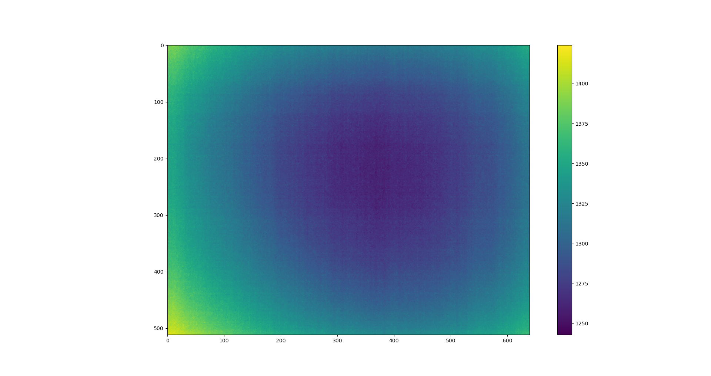

# Python program for FLIR Tau2 IR camera

### Credits

https://github.com/jveitchmichaelis with the flirpy package https://github.com/LJMUAstroecology/flirpy

## Quick start

Initiate classes by hand :

```python
# Import and create object from this class to adjust parameters of the camera
from tau2_class import *
Tau2 = FLIR_Tau2()
========== CMD : Connected to the FLIR Tau2 camera ==========
gain_mode, _ = Tau2.get_gain_mode()
gain_mode
>>> GAIN MODE : 0X0002 = High Gain Only
Tau2.__exit__() # need to exit before starting acquisition for protocol purposes
========== CMD : Disconnecting from camera ==========

# Import and create object from this class to start image acquisition
from tau2_grab import *
camera = TeaxGrabber()
========== ACQ : Connected to the FLIR Tau2 camera ==========
imlist = camera.grab_image(duration=1.0, display=True)
camera.__exit__() # need to exit before starting acquisition for protocol purposes
========== ACQ : Disconnecting from camera ==========
```

Customize and run *acquisition.py* script :
```python
run acquisition.py                                                                              
========== CMD : Connected to the FLIR Tau2 camera ==========
CMD : Response OK
CMD : Response OK
GAIN MODE : 0X0002 = High Gain Only
CMD : GAIN MODE IS CONFIGURED PROPERLY
CMD : Response OK
CMD : Response OK
Lens number: 0
CMD : LENS NUMBER IS CONFIGURED PROPERLY
CMD : Response OK
CMD : Response OK
SHUTTER temperature = 22.0C
CMD : SHUTTER TEMPERATURE IS CONFIGURED PROPERLY
CMD : Response OK
CMD : Response OK
FFC MODE : 0X0000 = Manual
CMD : FFC MODE IS CONFIGURED PROPERLY
CMD : Response OK
CMD : Response OK
FFC NFRAMES : 0X0002 =  16 frames
CMD : FFC FRAMES IS CONFIGURED PROPERLY
CMD : Response OK
CMD : Response OK
XP MODE : 0x0002 = CMOS 14-bit w/ 1 discrete
CMD : XP MODE IS CONFIGURED PROPERLY
CMD : Response OK
CMD : Response OK
CMOS BIT DEPTH : 0x0000 = 14bit
CMD : CMOS BITDEPTH IS CONFIGURED PROPERLY
CMD : Response OK
CMD : Response OK
TLIN MODE DISABLED : 0x0000 = disabled
CMD : TLINEAR MODE IS CONFIGURED PROPERLY
CMD : ALL PARAMETERS SET, CAN START ACQUISITION
CMD : Response OK
FPA temp: 21.0C
CMD : Response OK
Housing temp: 24.37C
========== CMD : Disconnecting from camera ==========
========== ACQ : Connected to the FLIR Tau2 camera ==========
2022-03-01T15:02:17 : Image sequence #0 written to FITS files
2022-03-01T15:02:18 : Image sequence #1 written to FITS files
2022-03-01T15:02:19 : Image sequence #2 written to FITS files
2022-03-01T15:02:20 : Image sequence #3 written to FITS files
2022-03-01T15:02:21 : Image sequence #4 written to FITS files
========== ACQ : Disconnecting from camera ==========
```

## Basic usage

- *tau2_class.py* contains `FLIR_Tau2` class, which allows to communicate with the camera through **serial** protocol and adjust settings (i.e. gain mode, FFC mode...)
- *tau2_grab.py* contains `TeaxGrabber` class, which allows to get RAW images from the camera and save them to **FITS** format through the **FTDI** protocol.
- *tau2_instructions.py* contains all instructions to send to the camera and *default_settings* dictionary which applies default parameters after camera initialization in **serial** mode.
- *acquisition.py* is a quick script which runs continuous acquisition of images.

## Example



## References
- FLIR Tau2/Quark2 software IDD : 102-PS242-43 version 133
- FLIR Tau2 product specification : 102-PS242-40 version 141
- FLIR Advanced Radiometry Application Note : 102-PS242-100-14 version 120
